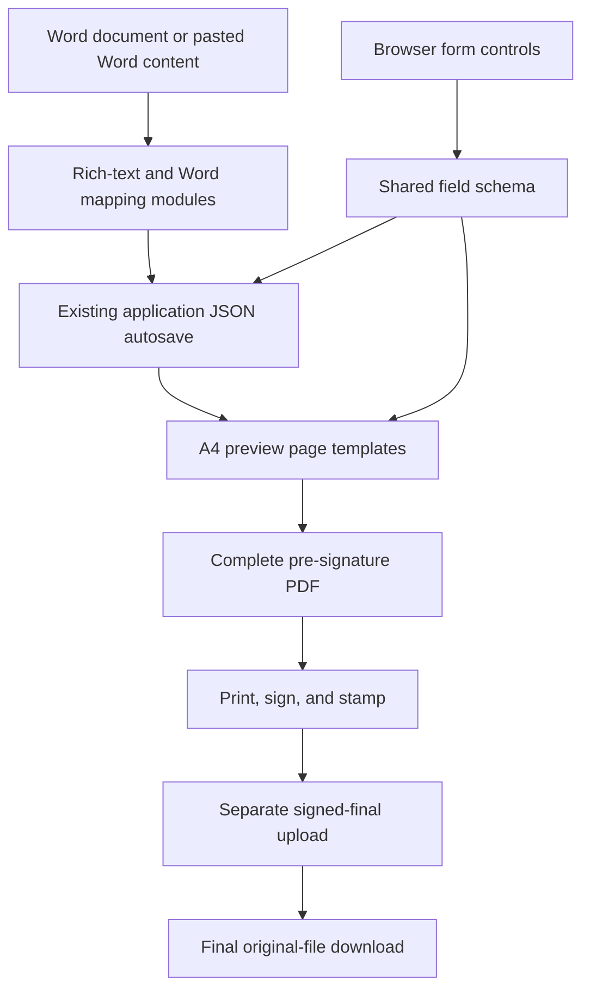
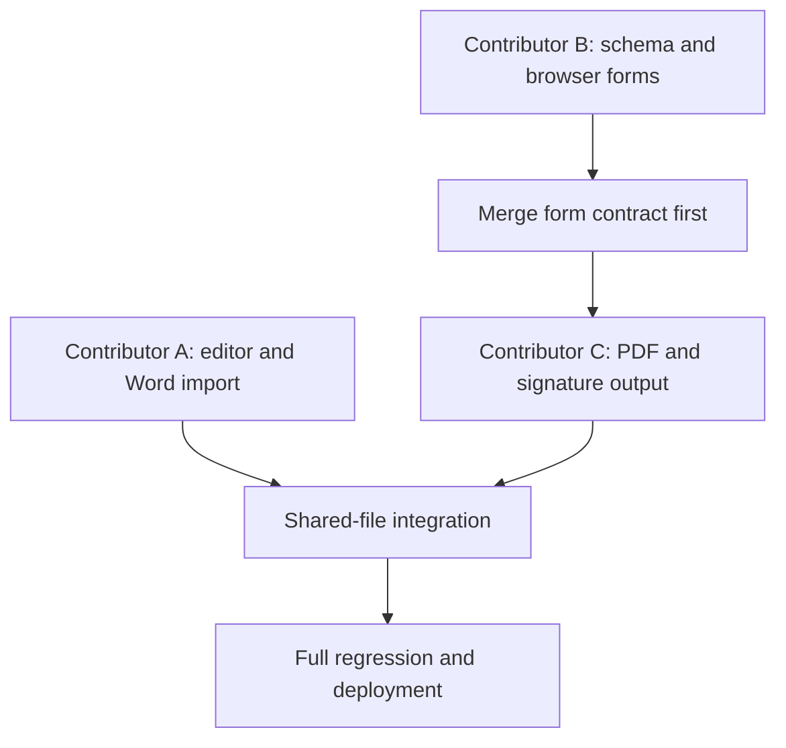

# feat: Collaborative form and document output upgrade

## Summary

Three contributors will upgrade editing, structured forms, Word import, and PDF delivery in parallel. New modules provide exclusive work areas, one shared schema keeps browser tables aligned with PDF tables, and one integration owner controls the existing monolithic entry files.

---

## Problem Frame

The current application puts the editor, form tables, entity forms, preview, and PDF export in `src/main.jsx`, with their styles in `src/styles.css`. Parallel edits to those files would cause frequent conflicts. The browser already captures structured records, but most preview sections flatten them into prose before PDF generation. Person and unit drag sorting exists in the detail sections, but it does not cover the basic-information tags, keyboard operation, or reliable touch interaction.

---

## Requirements

**Editing and import**

- R1. Long-text fields preserve supported Word formatting for font family, font size, weight, alignment, lists, links, and images through edit, save, reload, preview, and PDF output.
- R2. `Ctrl/Cmd + wheel` changes the shared editor view scale from 70% to 150% in 10% steps, defaults and resets to 100%, and never changes stored document font sizes or exported output.
- R3. The top-right toolbar imports Word documents into recognized structured fields and lets the user review selected changes before applying them.

**Structured browser forms**

- R4. Main people and main units can be reordered after entry using pointer, touch-friendly buttons, and keyboard-accessible controls; array order and rank remain synchronized.
- R5. Discipline classification follows the national discipline classification used by the National Science and Technology Awards. Users select at most three items according to the project's main technical direction, rank them by relevance, and the first item automatically determines the project's science and technology field.
- R6. Award, intellectual-property, paper, application-unit, economic, cooperation, person, and unit fields remain editable as structured browser forms with usable desktop and mobile layouts.
- R7. Person and unit entry emphasizes one selected record at a time, with a compact summary list and no loss of existing fields.

**PDF and signature delivery**

- R8. Every structured browser table renders as a real table in preview and generated PDF with the same labels, order, values, and empty-state rules.
- R9. Each person and each unit produces its own A4 form page in rank order, using the same saved record as the browser form.
- R10. The system exports a complete pre-signature version containing the required signature/stamp pages before users print and stamp it.
- R11. A signed final file is uploaded and downloaded separately from the PDF source used for recognition.
- R12. Existing PDF upload, chunking, OCR, extraction, and field-recognition behavior remains unchanged.

**Collaboration**

- R13. Each contributor owns a separate feature branch, module directory, stylesheet, and test file; only the integration owner edits shared entry and dependency files.
- R14. Every pull request demonstrates browser behavior, saved-data round trips, and the relevant preview/PDF result without including production data or real application documents.

---

## Key Technical Decisions

- **Shared table schema:** Browser controls and PDF templates consume `src/schema/table-fields.js`, so a field change cannot be completed on only one surface.
- **Versioned national discipline catalog:** Contributor B must record the authoritative government or National Science and Technology Awards source before entering catalog data. Every option carries the official code, name, hierarchy, source URL/document, effective version, and display order. Association-specific lists are not substitutes for this source.
- **Ranked discipline data:** Save `disciplines` as an ordered array of one to three `{ code, name }` values. Derive the read-only science and technology field from `disciplines[0]`; browser forms, Word mapping, preview, and PDF consume the same value and order.
- **View zoom differs from content formatting:** Editor zoom is local UI state; font family and size are document marks stored in sanitized HTML.
- **Review before Word overwrite:** Word parsing returns candidate fields and formatting for selection, following the existing PDF import confirmation pattern.
- **Format-aware Word support:** The first release supports `.docx` with a documented formatting allowlist. Legacy binary `.doc` import is deferred until a maintained parser and matching security limits are selected.
- **Bounded and offline Word parsing:** Word parsers run without network access and reject macros, encryption, external relationships, nested archives, and inputs exceeding configured compressed size, expanded size, entry count, ratio, time, or concurrency limits.
- **Sanitize at both trust boundaries:** Imported or pasted HTML is allowlist-sanitized before persistence and sanitized again before preview/PDF rendering; remote resources and executable URL/CSS forms are rejected.
- **Accessible ordering:** Dragging remains available, but explicit move-left/right or move-up/down actions are the reliable path for touch and keyboard users.
- **Hybrid PDF output:** A4 HTML remains the visual preview. Generated table pages use jsPDF text/table primitives with an embedded Chinese font so their values are searchable and selectable; rich-text pages may retain the current canvas rendering. Dedicated pagination replaces prose serialization and prevents row clipping.
- **Separate document roles:** Recognition source, recommendation signature attachment, generated signature draft, and uploaded signed final are distinct artifacts, matching the automation association's public distinction between signature draft and final application PDF.
- **Signed-final integrity:** Signed finals accept verified PDF content only, retain a content hash and replacement audit history, download as non-cacheable attachments, and never enter recognition or generated-PDF processing.
- **Single integration owner:** Contributor A alone connects new modules through `src/main.jsx`, `src/styles.css`, `server.mjs`, and dependency files after B and C land their owned modules.

---

## High-Level Technical Design

---

## Three-Person Assignment

| Owner | Branch | Primary outcome | Exclusive work area | Approximate load |
|---|---|---|---|---:|
| Contributor A | `feature/editor-word` | Word-compatible editing, zoom, `.docx` import, final integration | `src/editor/`, `src/import/`, `lib/word-fields.mjs`, `routes/word-import.mjs`, `tests/fixtures/synthetic-import.docx`, `tests/rich-text-word.e2e.spec.js` | 34% |
| Contributor B | `feature/form-fields` | Browser field tables, national discipline catalog, ranked discipline/person/unit controls and simplified entry | `src/forms/`, `src/data/disciplines.js`, `src/schema/table-fields.js`, `src/utils/reorder.js`, `tests/forms-ordering.e2e.spec.js` | 33% |
| Contributor C | `feature/pdf-output` | Searchable PDF tables, one-person/one-unit pages, pre-signature and signed-final flow | `src/export/`, `lib/signed-final-files.mjs`, `routes/signed-final.mjs`, `tests/pdf-export.e2e.spec.js` | 33% |

Contributor A is the integration owner for `src/main.jsx`, `src/styles.css`, `server.mjs`, `package.json`, `package-lock.json`, `README.md`, and `tests/e2e.spec.js`. Contributors B and C must not edit those shared files in their feature branches; they deliver importable modules and document required connection points in their pull requests.

### Browser-to-PDF Ownership Matrix

| Data group | Browser owner | Shared definition | PDF owner | Required output |
|---|---|---|---|---|
| Award records | B | `src/schema/table-fields.js` | C | Award table with matching columns |
| Intellectual property | B | `src/schema/table-fields.js` | C | Intellectual-property table with matching columns |
| Papers and books | B | `src/schema/table-fields.js` | C | Publication table with matching columns |
| Application units | B | `src/schema/table-fields.js` | C | Application-unit table with matching columns |
| Economic results | B | `src/schema/table-fields.js` | C | Summary plus yearly economic table |
| Cooperation records | B | `src/schema/table-fields.js` | C | Cooperation table with matching columns |
| Main people | B | `src/schema/table-fields.js` | C | One ranked A4 table page per person |
| Main units | B | `src/schema/table-fields.js` | C | One ranked A4 table page per unit |

---

## Implementation Units

### U1. Browser schema and structured forms

- **Owner:** Contributor B.
- **Goal:** Make browser-side fields, ordering, and table definitions complete and reusable by PDF output.
- **Requirements:** R4, R5, R6, R7, R8, R9, R13, R14.
- **Dependencies:** None; merge the schema contract before Contributor C completes PDF templates.
- **Files:** Create `src/schema/table-fields.js`, `src/data/disciplines.js`, `src/utils/reorder.js`, `src/forms/BasicInfoForm.jsx`, `src/forms/DisciplineSelector.jsx`, `src/forms/EntityForms.jsx`, `src/forms/RecordTables.jsx`, `src/forms/forms.css`, and `tests/forms-ordering.e2e.spec.js`.
- **Required form copy:** `学科分类：按照国家学科分类标准（与国家科学技术奖励学科分类口径一致），以项目主要技术方向为依据，最多可选择 3 项，按与项目内容的紧密程度排序。填写的第一项学科默认为所属科学技术领域。`
- **Approach:** Extract existing form logic while retaining existing JSON keys. Define labels, input types, widths, required flags, and PDF visibility once in the shared schema. The discipline selector is a hierarchical combobox searchable by official code or name; selected items appear as a numbered 1-3 list with move and remove actions, duplicate selection is blocked, and the add action is disabled at three. Show the field derived from item one as a read-only value beside the list. Retain unknown legacy values as `pending confirmation` until the user replaces them.
- **Ordering accessibility:** Every person, unit, and discipline row has named move-up and move-down buttons with at least 44 by 44 CSS-pixel targets. Disable the impossible action at each boundary, keep focus on the moved record, and announce the new rank through an `aria-live` region. Dragging is an enhancement, never the only ordering method.
- **Responsive tables:** Desktop shows complete editable tables. Narrow screens retain table semantics inside their own horizontal scroll containers while the page itself never scrolls horizontally; the identifying column and row actions remain visible.
- **Entity edit lifecycle:** An empty list has one create action. A newly created record becomes selected. Switching records preserves validation errors and focus, deleting the current record requires confirmation and selects the next or previous record, and deleting the last record returns to the empty state. Mobile return-to-list restores the prior item focus and scroll position.
- **Filling guidance:** Add concise, field-level filling guidance for every browser form and structured table changed by Contributor B. Guidance, terminology, length limits, required status, and examples must follow the official Word application template; expose it next to the relevant field instead of as a detached general help page.
- **Patterns to follow:** Existing `ManualRecordsTable`, `SortableEntityTabs`, `normalizePerson`, `normalizeUnit`, and 700 ms autosave behavior in `src/main.jsx`.
- **Test scenarios:**
  - Add three people and three units, reorder each by drag and buttons, reload, and verify names and numeric ranks retain the new order.
  - Operate ordering using only the keyboard and verify focus remains on the moved entity.
  - Reorder at mobile width without horizontal page overflow.
  - Select three national catalog disciplines, reorder them, save, reload, and verify the first selection determines the displayed science and technology field in both browser and PDF.
  - Search the discipline catalog by code and Chinese name, reject duplicates, and verify all three ranks use official code/name pairs from the recorded catalog version.
  - Attempt a fourth discipline and verify the selector prevents it without changing the saved three-item order.
  - Load a legacy free-text discipline and verify it remains visible for review and is not discarded.
  - Change the first discipline through browser entry and Word mapping, then verify saved data, read-only field, preview, and PDF all update to the same derived science and technology field.
  - Add, edit, and delete a row in every structured table and verify autosaved JSON contains the configured fields.
  - Open the guidance for each changed form area and verify it matches the corresponding Word-template instruction without hiding or shifting the input on desktop or mobile.
- **Verification:** The browser forms expose every schema field on desktop and mobile, with stable saved data and no edits to PDF recognition code.

### U2. Rich-text and Word import

- **Owner:** Contributor A.
- **Goal:** Support Word-oriented long-text formatting, view zoom, and top-right Word field import.
- **Requirements:** R1, R2, R3, R12, R13, R14.
- **Dependencies:** Consume stable field keys from U1 when structured Word mapping is integrated.
- **Files:** Create `src/editor/RichTextEditor.jsx`, `src/editor/rich-text.css`, `src/import/WordImportDialog.jsx`, `src/import/word-field-map.js`, `lib/word-fields.mjs`, `routes/word-import.mjs`, `tests/fixtures/synthetic-import.docx`, and `tests/rich-text-word.e2e.spec.js`. Contributor A alone updates the shared integration files listed above.
- **Approach:** Extend the current Tiptap editor with a bounded font family and size set that survives sanitization and preview. Normalize pasted Word HTML to supported marks. Use one session-wide editor zoom state with 70%-150% bounds, 10% steps, a visible current value, and reset; intercept `Ctrl/Cmd + wheel` only while an editor has focus. Parse `.docx` headings and tables into candidate field values and require explicit selection before merging. Use only synthetic fixtures without personal data.
- **Import states:** Define file selection, parsing progress, parse failure, no matches, partial matches, candidate review, applying, apply failure, and success. Candidate rows show current value, proposed value, source, confidence, and conflict status. Non-empty fields are unselected by default; repeating records append with deterministic de-duplication. Cancel and every failure leave the original draft unchanged.
- **Filling guidance:** Add contextual filling guidance to every long-text editor and Word-import area changed by Contributor A. Use the official Word template as the source for section purpose, content expectations, word limits, formatting, and image requirements; keep the guidance attached to its field and separate from imported document content.
- **Security posture:** Apply tag, attribute, CSS-property, and URL-protocol allowlists before save and before render. Reject event attributes, script URLs, remote images, CSS URLs, dangerous data URLs, external Word relationships, macros, and resource-exhausting archives. Clean temporary files after success, rejection, and timeout.
- **Patterns to follow:** Existing PDF import review interaction, file ownership checks, `DOMPurify` sanitization, rich-image upload, and `applicationFromRow` JSON persistence.
- **Test scenarios:**
  - Paste formatted Word content containing font, size, bold, alignment, list, and image; save and reload with supported formatting preserved.
  - Import a synthetic `.docx`, review candidate basic, long-text, person, unit, and table fields, apply a subset, and verify unselected saved fields remain unchanged.
  - Select a legacy `.doc` file and verify the UI explains that this release accepts `.docx` without uploading or changing the draft.
  - Reject unsupported, malformed, oversized, password-protected, macro-enabled, externally linked, archive-bomb, and timeout documents without changing the draft or leaving temporary files.
  - Import hostile Word HTML and verify executable markup and remote resources remain absent after save, reload, preview, and export.
  - Zoom with `Ctrl/Cmd + wheel`, then verify stored HTML and generated preview typography are unchanged.
  - Verify every changed editor/import area exposes the matching Word-template guidance and that the guidance itself is never saved into, imported over, or exported as application content.
- **Verification:** Word import is visible in the top toolbar, all overwrites require confirmation, and existing PDF import endpoints and extraction tests remain untouched.

### U3. PDF tables, entity pages, and signature flow

- **Owner:** Contributor C.
- **Goal:** Produce complete A4 output that mirrors browser tables and supports a clear pre-signature-to-final workflow.
- **Requirements:** R1, R4, R6, R8, R9, R10, R11, R12, R13, R14.
- **Dependencies:** U1 shared schema; Contributor C rebases after that schema is merged.
- **Files:** Create `src/export/PdfPreview.jsx`, `src/export/TablePages.jsx`, `src/export/PersonUnitPages.jsx`, `src/export/pdf-builder.js`, `src/export/pdf.css`, `lib/signed-final-files.mjs`, `routes/signed-final.mjs`, and `tests/pdf-export.e2e.spec.js`.
- **Approach:** Replace prose serialization of structured records with semantic HTML preview tables and searchable PDF table primitives. Embed a repository-approved Chinese font and paginate at row and record boundaries, repeat table headers, and prevent clipped rows. Generate one full A4 form page for each person and unit in saved rank order. Add signature/stamp pages only after their official page templates and positions are recorded.
- **Signed-final state model:** Treat recognition source, recommendation attachment, generated signature draft, and uploaded signed final as separate server-assigned roles. The UI exposes `not generated`, `generated`, `uploading`, `validation failed`, and `uploaded` states. Replacing the current signed final requires confirmation; the new valid PDF becomes current atomically, while the prior hash, uploader, timestamp, and protected file remain in audit history. Signed finals are never recognized or re-rendered.
- **Patterns to follow:** Existing `PreviewPageOne`, `PreviewDialog`, `html2canvas`, `jsPDF`, authenticated attachment storage, and original-file download behavior.
- **Test scenarios:**
  - Populate every browser table and verify preview contains semantic tables with the same headers, row order, and values.
  - Extract text from the generated PDF and verify table headers and Chinese cell values are present and selectable rather than embedded only as a page image.
  - Export multi-page tables and verify headers repeat and no row is clipped or silently omitted.
  - Reorder people and units, export, and verify one page per entity follows the new rank order.
  - Verify long formatted text and images remain within A4 page bounds.
  - Generate the complete pre-signature PDF and verify signature/stamp pages occur in the required final positions.
  - Upload a signed final file and verify its download is byte-identical while the recognition source remains unchanged.
  - Attempt to spoof an attachment role or access another user's signed final and verify the server rejects the request.
  - Replace a signed final and verify the new file becomes current while the prior version and audit record remain protected.
  - Generate PDFs at desktop and mobile viewports and verify output does not depend on viewport width.
- **Verification:** PDF page count, text extraction, visual screenshots, and downloaded file identity prove that no configured field or signature artifact is lost.

### U4. Integration and release regression

- **Owner:** Contributor A as integration owner; B and C review only.
- **Goal:** Connect all modules with minimal changes to shared files and release a regression-tested build.
- **Requirements:** R1-R14.
- **Dependencies:** U1, U2, U3.
- **Files:** Modify only `src/main.jsx`, `src/styles.css`, `server.mjs`, `package.json`, `package-lock.json`, `README.md`, and `tests/e2e.spec.js` as required for final integration.
- **Approach:** Replace monolithic implementations with imports, mount the isolated Word and signed-final routes, add only the additive signed-final metadata migration needed by C's module, connect the shared table schema to preview templates, and document `.docx` support and the signing workflow. Apply the same rich-text allowlist on the server before persistence. Do not refactor unrelated authentication, storage, or PDF extraction behavior.
- **Test scenarios:**
  - Complete a new application from browser entry through preview, pre-signature export, signed-final upload, and final download.
  - Import Word fields into an existing partially completed draft and verify unrelated fields survive autosave.
  - Run all existing PDF extraction, asynchronous, chunked, source-field, and Playwright scenarios without behavioral changes.
  - Verify mobile layout, authentication isolation, attachment permissions, and submit validation remain intact.
- **Verification:** Production build and all old and new tests pass; the deployed health endpoint remains healthy after the integration owner updates the running service.

---

## Collaboration and Synchronization

1. Protect `main` in GitHub: require pull requests, one approval, and passing checks; disable direct pushes for collaborators.
2. Invite all three GitHub accounts under repository collaborators. Each person clones the repository and works only on the assigned branch and exclusive files.
3. At the start of each work session, update the local view of `origin/main` and replay the feature branch on top of it before new edits.
4. Push small coherent commits to the assigned branch and open a draft pull request early. Use the PR description to list schema changes, connection points, screenshots, and tests.
5. Merge order is B schema/forms, then C PDF output, then A editor/Word and shared-file integration. Contributor C refreshes from `main` after B merges; Contributor A refreshes after both B and C merge.
6. The owner of a file resolves conflicts in that file. Contributors do not solve conflicts by copying an entire old `src/main.jsx` or `src/styles.css` over the current branch.
7. Never commit `data/`, production databases, passwords, Cloudflare credentials, user uploads, or real application documents. Synthetic fixtures belong only under `tests/fixtures/`.
8. Merging GitHub code does not deploy it. After final review, the integration owner updates this computer, builds once, runs regression tests, and restarts the public service.

This workflow coordinates source-code development. It does not provide simultaneous editing of the same live application record; the current whole-document autosave remains last-write-wins.

---

## System-Wide Impact

- **Persistence:** Existing application JSON keys remain readable. The discipline array expands from two to at most three ordered values, while signed-final integrity and audit metadata may require an additive file-table migration.
- **Trust boundaries:** Word input is untrusted before parsing, imported HTML is untrusted before save and render, and every file role is assigned and validated by the server rather than accepted from a client category string.
- **File lifecycle:** Word temporary files are bounded and deleted after every outcome. Recognition sources remain immutable to the new flow; generated signature drafts are reproducible outputs; signed finals retain protected replacement history.
- **Privacy:** Signed files may contain signatures, identity documents, and seals. They default to attachment download with no-cache responses and remain subject to project ownership on list, upload, download, replacement, and deletion.
- **Operations:** Automated tests, screenshots, traces, logs, and downloadable artifacts use synthetic data. Production uploads, document bodies, filenames, and parser errors must not leak into GitHub or routine logs.
- **Deployment:** GitHub merges change source only. The current computer remains the runtime and data owner, so rollout is controlled by the integration owner after backup, regression verification, build, and service health checks.

---

## Acceptance Examples

- AE1. Given a contributor changes an economic field label, when the browser form and PDF preview render, then both use the same new label from the shared schema.
- AE2. Given three named people, when the second person is moved to first on a touch device, then the saved ranks, basic page, individual form pages, and final PDF all show the same order.
- AE3. Given Word content with supported font formatting, when it is pasted or imported and the draft is reloaded, then preview and PDF retain that supported formatting while editor zoom has no effect on output.
- AE4. Given a completed application without signatures, when the user exports the pre-signature version, then it includes all form tables and required signature pages ready for printing and stamping.
- AE5. Given a signed-final upload, when the user downloads the final version, then the system returns that original file without replacing or reprocessing the recognition source.
- AE6. Given three ranked official disciplines, when the first selection changes, then browser storage, Word mapping, preview, and PDF preserve the same order and show the science and technology field derived from the new first item.

---

## Risks and Dependencies

- **Classification provenance:** The national dataset could be sourced from the wrong taxonomy or version. Release requires a recorded official source, code, label, version, and reviewer; journal, conference, and association-only categories are rejected.
- **Word fidelity:** Word has no single stable HTML representation. A documented allowlist, synthetic Microsoft Word/WPS fixtures, and visible degradation warnings bound the supported behavior.
- **Parser resource exhaustion:** Compressed documents can expand into excessive memory, CPU, files, or time. Compressed size, expanded bytes, item count, ratio, nesting, timeout, concurrency, and temporary-file limits apply before and during parsing.
- **Stored XSS and remote-resource leakage:** Imported formatting can carry executable markup or tracking resources. Sanitization occurs before persistence and before rendering, and images must resolve to an authorized attachment owned by the current project.
- **Attachment-role spoofing:** A client-provided category could replace a recognition source or impersonate a signed final. Server-side role allowlists, legal state transitions, file signature validation, ownership checks, hashes, and audit records protect every operation.
- **Sensitive signed artifacts:** Final PDFs may contain signatures, seals, and identity evidence. Non-cacheable forced downloads, restricted ownership, retained hashes, protected replacement history, and matching backup controls reduce exposure.
- **PDF font and clipping:** Searchable Chinese tables require a redistributable embedded font and can increase file size. Record the font license, subset it where practical, then gate release on row-aware pagination, repeated headers, extracted-text assertions, page-count checks, and visual screenshots.
- **Test and log leakage:** Screenshots, traces, downloads, logs, and temporary files can expose applicant data. CI uses synthetic fixtures, suppresses document bodies and sensitive filenames in logs, and checks that ignored production paths are never committed.
- **Recognition regression:** Shared server or dependency edits could alter current PDF behavior. Word uses separate middleware, queues, temporary paths, and file roles; existing sync, async, chunked, permission, and field-baseline tests remain mandatory.
- **Schema dependency:** Contributor C depends on Contributor B's schema. Both owners approve any contract change made after PDF work begins, and Contributor A integrates only matching revisions.

---

## Scope Boundaries

### In Scope

- All requested editor, sorting, discipline, Word import, browser table, PDF table, individual page, and signature-flow work.
- Structural extraction of existing front-end code only where needed to establish the three exclusive work areas.
- Tests and documentation required to merge and deploy the three work streams safely.

### Deferred to Follow-Up Work

- Real-time multi-user co-editing of the same application record, presence indicators, field locking, and conflict resolution.
- Migrating SQLite to PostgreSQL or moving file storage to object storage.
- Replacing the temporary Cloudflare URL with a fixed domain and Named Tunnel.

### Explicit Non-Goals

- Rewriting or tuning existing PDF OCR and field-recognition behavior.
- Committing production user data or real award documents to GitHub.
- Pixel-perfect reproduction of every possible Word style or macro-enabled document.
- Legacy binary `.doc` parsing in the first release.

---

## Sources and Research

- `src/main.jsx`: existing Tiptap editor, table forms, person/unit ordering, preview, PDF export, and import integration points.
- `src/styles.css`: current editor, table, entity, A4 preview, print, desktop, and mobile conventions.
- `server.mjs`: application JSON persistence, authenticated file storage, and protected PDF recognition routes.
- `tests/e2e.spec.js`: current end-to-end regression pattern.
- `tests/pdf-extraction.mjs`, `tests/pdf-extraction-async.mjs`, `tests/pdf-extraction-chunked.mjs`, and `tests/project-source-extraction.mjs`: immutable PDF-recognition regression boundary.
- `节能奖填报材料/附件2.中国节能协会创新奖申报书.doc`: local form layout reference; excluded from GitHub because application materials may contain sensitive content.
- [Chinese Association of Automation 2026 award notice](https://www.caa.org.cn/Content/117.html): confirms online form completion and that the completed recommendation document is the primary review artifact.
- [Chinese Association of Automation application system](https://j-p.caa.org.cn/): exposes separate signature-draft download and final application PDF behavior; it is a workflow reference, not the source of the national discipline catalog required by R5.
- [Official application PDF download script](https://j-p.caa.org.cn/js/eaward-application-pdf-download.js?v=3): confirms guarded asynchronous PDF composition, final/application modes, and online PDF preview.
- [Official template guide script](https://j-p.caa.org.cn/js/eaward-form-template-guides-modal.js?v=2): confirms Word template formats but provides no evidence of structured Word import; Word mapping in this plan is a new project capability.
- **Required before catalog implementation:** record the official national discipline catalog URL or document title, issuing authority, effective version/date, code hierarchy, and reviewer in `src/data/disciplines.js`; implementation must not infer the catalog from the automation association UI.
